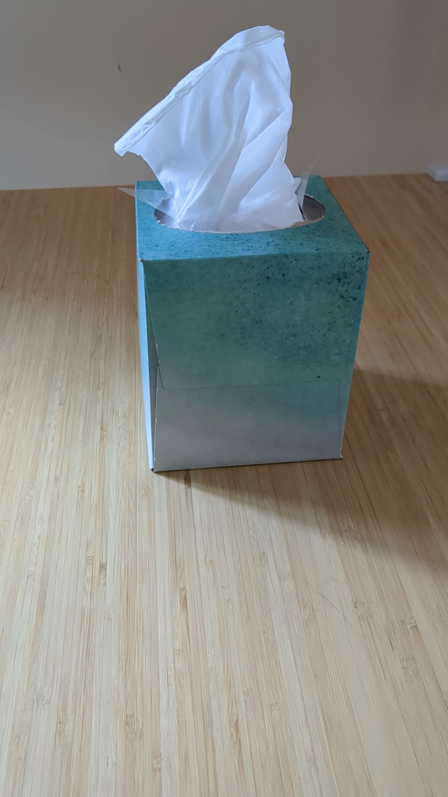
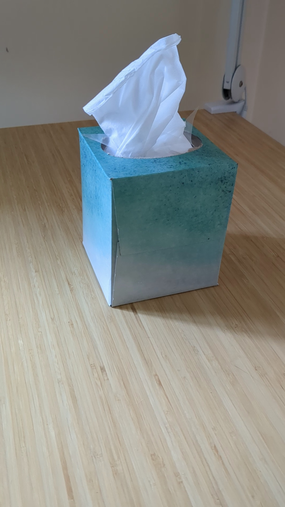
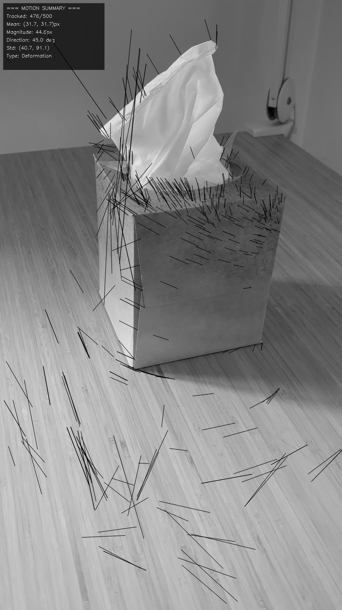
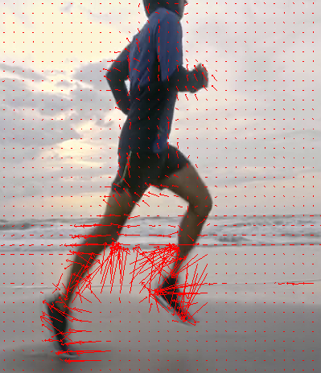

# Lucas-Kanade

Originally was designed in dense optical flow, but can be used in sparse optical flow.

## Example

Assumptions:
* Brightness consistency
* Temporal persistence ("small movements")
* Spatial coherence (neighbors stay neighbors)

# Farneback
